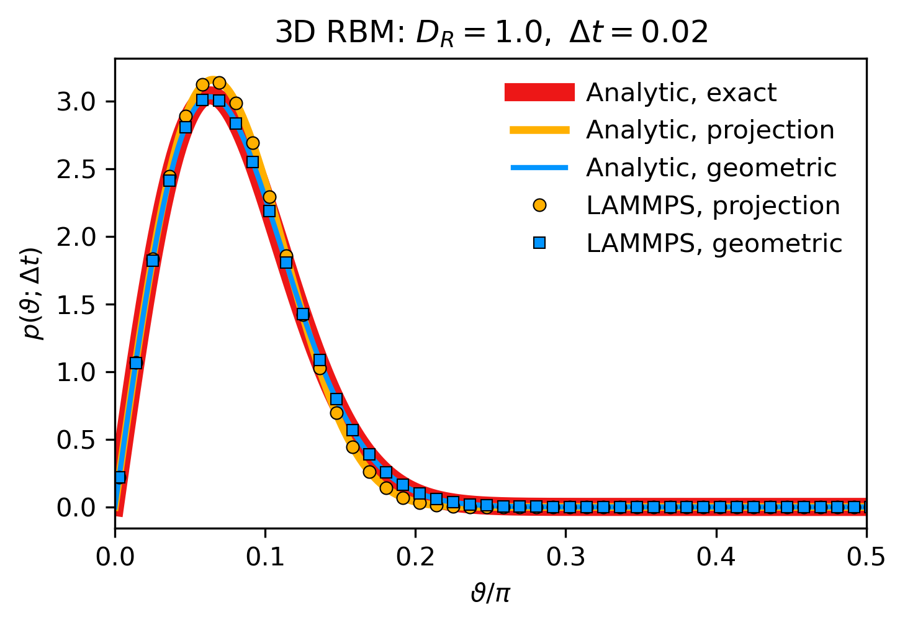
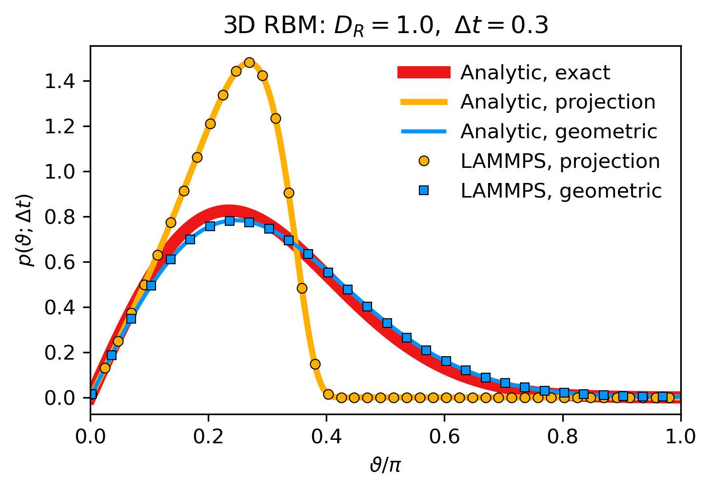

# lammps-rbm

This repository analyzes **fully overdamped rotational Brownian motion (RBM)** in LAMMPS and compares single-step rotation-angle **probability density functions (PDFs)** computed by different rotational integrators:

- the common linear **Euler + projection** scheme and
- a **geometric integrator** (proposed in the reference).

Generally, the integrators target RBM of **axisymmetric particles** in two (2D) and (3D) dimensions. Here we benchmark the methods on a fully symmetric particle with an orientation vector (LAMMPS `fix brownian/sphere`) against **analytical one-step PDFs** for torque-free diffusion in both **2D** (**circle**, orientation space $S^1$) and **3D** (**sphere**, orientation space $S^2$).

**Jupyter Notebooks:** Comparison of PDFs for [**2D RBM**](notebooks/compare_rbm_angle_pdfs_circle.ipynb) and [**3D RBM**](notebooks/compare_rbm_angle_pdfs_sphere.ipynb).

**Reference:** Felix Höfling & Arthur V. Straube, *Phys. Rev. Research* **7**, 043034 (2025), doi: [10.1103/wzdn-29p4](https://doi.org/10.1103/wzdn-29p4)

## Main result

- For sufficiently small timesteps (left panel), both the common Euler + projection scheme and the proposed geometric integrator reproduce the analytical one-step PDF well.
- For larger timesteps (right panel), the Euler+projection scheme deviates strongly and shows a hard cutoff (finite support) in $\vartheta$, unlike the exact PDF; the geometric integrator avoids this qualitative artifact and remains close to theory.
- The geometric integrator allows for about ten times larger integration steps, depending on interaction potentials, and speeds up simulations.

   &ensp;
    
  PDFs for 3D RBM (sphere): Small timestep Δt=0.02 (left). Large timestep: Δt=0.30 (right).

## Repository layout

- `rbm/` — helper module used by notebooks (I/O, plotting)
- `config/` — sets path to LAMMPS executable
- `inputs/` — LAMMPS input scripts
- `scripts/` — launch + postprocessing
- `notebooks/` — comparisons of PDFs (LAMMPS numerics against theory) 
- `outputs/` — generated LAMMPS logs + raw angles
- `data/` — generated PDFs, intermediate cleaned angle data files
- `figs/` — generated figures (PNG/PDF)

## Pipeline (LAMMPS → PDFs → figures)

0. **Setup** (point to your LAMMPS executable)

   Create `config/lammps_path.txt` containing one line: the path to your `lmp` executable. If the file is absent, the launcher falls back to calling `lmp` from `PATH`.

1. **Run LAMMPS** to generate raw angle samples  
   
      * Universal launcher `scripts/run_rbm.py` (uses input script `inputs/in.rbm`)  
         → `outputs/angles_<manifold>_<method>.raw` (raw angle sample)  
         → `outputs/log_rbm_<manifold>_<method>.lammps` (LAMMPS log) 

      * Choice of dimension:  
            - `manifold=circle` (2D RBM)  
            - `manifold=sphere` (3D RBM)  
      * Choice of integrator:  
            - `method=projection` (Euler + projection scheme)  
            - `method=geometric`  (geometric scheme)

2. **Compute PDFs from LAMMPS angles** (numerics):

   * `scripts/compute_pdf_from_angles.py`  
     → `data/pdf_lammps_<manifold>_<method>_Dr<Dr>_dt<dt>.dat`

3. **Compute analytical PDFs** (exact, projection, geometric):

   * `scripts/compute_pdf_from_theory.py`  
      → `data/pdf_theory_<manifold>_exact_Dr<Dr>_dt<dt>.dat`  
      → `data/pdf_theory_<manifold>_projection_Dr<Dr>_dt<dt>.dat`  
      → `data/pdf_theory_<manifold>_geometric_Dr<Dr>_dt<dt>.dat`

4. **Compare and plot** (loads precomputed `.dat` files):

   * [2D RBM](notebooks/compare_rbm_angle_pdfs_circle.ipynb): `notebooks/compare_rbm_angle_pdfs_circle.ipynb` → figures in `figs/` (PNG/PDF)
   * [3D RBM](notebooks/compare_rbm_angle_pdfs_sphere.ipynb): `notebooks/compare_rbm_angle_pdfs_sphere.ipynb` → figures in `figs/` (PNG/PDF)
   

