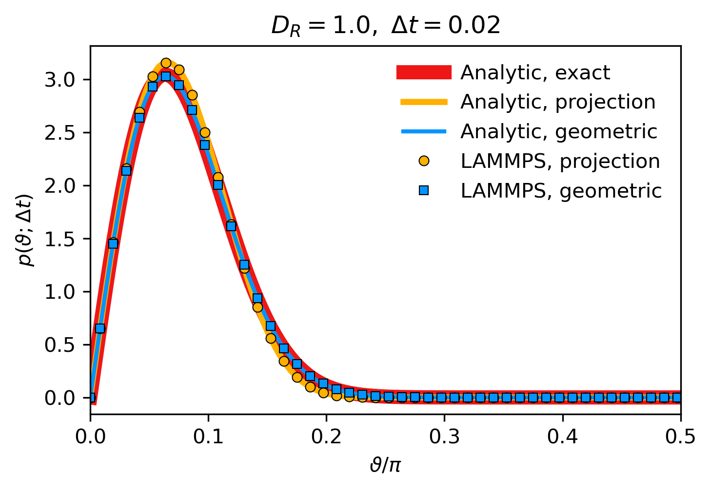
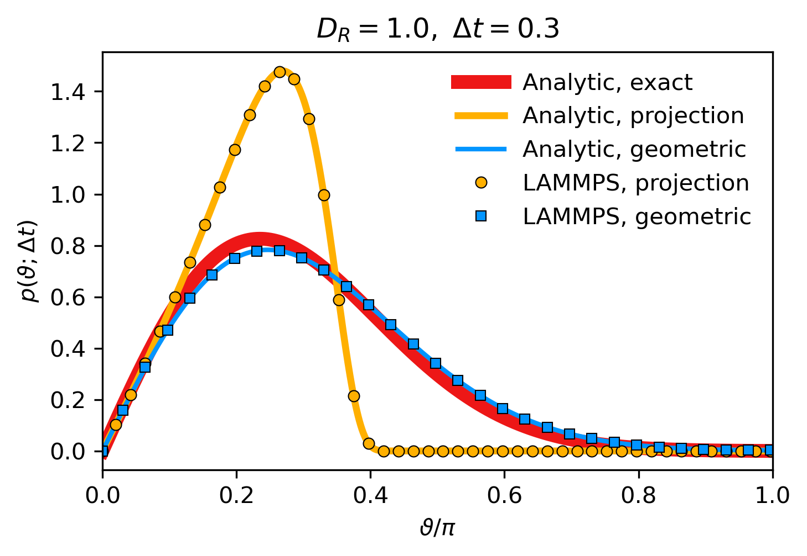

# lammps-rbm

This repository analyzes **fully overdamped rotational Brownian motion (RBM)** in LAMMPS and compares single-step rotation-angle **probability density functions (PDFs)** computed by different rotational integrators:

- the current **Euler + projection** scheme and
- an improved **geometric integrator** (proposed in the reference).

The integrators target RBM of **axisymmetric particles** (orientation dynamics on the unit sphere with rotational diffusion). We benchmark the methods on a spherical particle with an orientation vector (`fix brownian/sphere`) for direct comparison with **analytical PDFs**.

**Reference:** Felix Höfling & Arthur V. Straube, *Phys. Rev. Research* **7**, 043034 (2025), doi: [10.1103/wzdn-29p4](https://doi.org/10.1103/wzdn-29p4)

## Main result

- For sufficiently small timesteps (left panel), both the current **Euler + projection** scheme and the proposed **geometric integrator** reproduce the analytical one-step PDF well.
- For larger timesteps (right panel), the Euler+projection scheme deviates strongly, whereas the geometric integrator remains close to the analytical result.

  
    
  Small timestep: Δt=0.02 (left). Large timestep: Δt=0.30 (right).

## Pipeline (LAMMPS → PDFs → figures)

1. **Run LAMMPS** to generate raw angle samples  
   (input scripts in `inputs/`, logs in `outputs/`).
2. **Compute PDFs from LAMMPS angles** (numerics):

   * `scripts/compute_pdf_from_angles.py` → `data/pdf_lammps_{proj,geom}\...dat`

3. **Compute analytical PDFs** (exact / projection / geometric):

   * `scripts/compute_pdf_analytic.py` → `data/pdf_analyt_{exact,proj,geom}_...dat`

4. **Compare and plot** (loads precomputed `.dat` files):

   * `notebooks/compare_rbm_angle_pdfs.ipynb` → figures in `figs/` (PNG/PDF)

